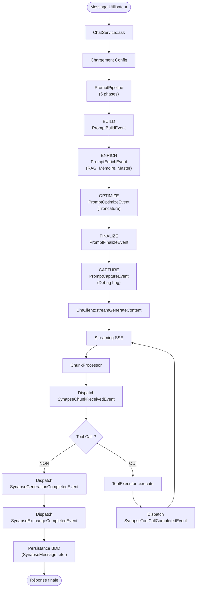

# Architecture & Flux

Synapse Core repose sur un flux d'exécution séquentiel et hautement **événementiel**. Le pipeline de prompt est le cœur du système.

## Pipeline Prompt (5 Phases)

Le système de prompt est structuré en **5 phases événementielles** orchestrées par `PromptPipeline` :

### Phase 1 : BUILD (`PromptBuildEvent`)
Construction initiale du prompt par `ContextBuilderSubscriber` :
- System prompt de base (depuis la config ou l'agent actif)
- Tone injecté (`SynapseTone.systemPrompt` si agent a un ton)
- Historique des messages (depuis les options ou la BDD)
- Définitions des outils disponibles (depuis `ToolRegistry`)

### Phase 2 : ENRICH (`PromptEnrichEvent`)
Enrichissement du contexte via subscribers :
- **`RagContextSubscriber`** : Injecte les chunks RAG pertinents (si agent a des sources RAG)
- **`MemoryContextSubscriber`** : Injecte les souvenirs vectoriels de l'utilisateur (score ≥ 0.7)

### Phase 3 : OPTIMIZE (`PromptOptimizeEvent`)
Optimisation et troncature :
- **`ContextTruncationSubscriber`** : Tronque l'historique et le contexte si dépassement de `maxTokens`
- Utilise une heuristique locale (règle simple : tokens ≈ chars/4)

### Phase 4 : FINALIZE (`PromptFinalizeEvent`)
Finalisation avec la directive fondamentale :
- **`MasterPromptSubscriber`** : Injecte le master prompt global en queue du message système — s'exécute après ENRICH et OPTIMIZE pour garantir qu'il est toujours présent et jamais tronqué

### Phase 5 : CAPTURE (`PromptCaptureEvent`)
Capture du prompt final pour le debug :
- **`DebugLogSubscriber`** : Enregistre le payload complet en `SynapseDebugLog`

---

## Flux Multi-tour avec Tool Calling

Une fois le prompt construit, le système entre dans une **boucle multi-tour** (max `maxTurns = 5`) :

```
Tour 1:
  ↓
  ChatService::ask() → Config Load
  ↓
  PromptPipeline (5 phases) → Prompt final
  ↓
  LlmClient::streamGenerateContent() → Streaming SSE
  ↓
  ChunkProcessor (parse SSE) → NormalizedChunk
  ↓
  Dispatch SynapseChunkReceivedEvent (répété chaque token)
  ↓
  Tool Call détecté ?
    NON → Fin (Dispatch SynapseGenerationCompletedEvent)
    OUI → Exécution ci-dessous

  ToolExecutor::execute(toolName, params) → Résultat
  ↓
  Dispatch SynapseToolCallCompletedEvent
  ↓
Tour 2+ : Retour au streaming avec résultat du tool en message assistant
```

---

## Composants Clés

| Composant | Rôle |
|-----------|------|
| **ChatService** | Point d'entrée principal (`ask()`, `resetConversation()`) |
| **ConfigProviderInterface** | Fournit la config runtime (via BDD) |
| **PromptPipeline** | Orchestre les 5 phases du prompt |
| **PromptBuilder** | Construit le prompt système initial |
| **Subscribers** | Enrichissent le prompt (RAG, mémoire, contexte app) |
| **LlmClient** | Envoie au provider (Gemini, OVH, etc.) |
| **ChunkProcessor** | Parse le streaming SSE en chunks normalisés |
| **MultiTurnExecutor** | Gère la boucle jusqu'à `maxTurns` |
| **ToolRegistry** | Registre des outils disponibles |
| **ToolExecutor** | Exécute les tool calls |
| **AgentResolver** | Résout un agent par nom (agents code + agents BDD) |
| **WorkflowRunner** | Exécute un `SynapseWorkflow` via `MultiAgent` |

---

## Événements Dispatché

**Ordre de séquence** :

1. `SynapseGenerationStartedEvent` — Début global
2. *Phases du PromptPipeline* : `PromptBuildEvent`, `PromptEnrichEvent`, `PromptOptimizeEvent`, `PromptFinalizeEvent`, `PromptCaptureEvent`
3. `SynapseChunkReceivedEvent` — Répété pour chaque token (streaming)
4. `SynapseStatusChangedEvent` — Passage de thinking → generating (optionnel, si extended thinking)
5. `SynapseTokenStreamedEvent` — Chaque token individuel (granularité maximale)
6. `SynapseToolCallRequestedEvent` — Si outil demandé
7. `ToolExecutor` exécute → `SynapseToolCallCompletedEvent` — Résultat du tool
8. *(Retour étape 3 si plus de tool calls)*
9. `SynapseGenerationCompletedEvent` — Fin de génération textuelle
10. `SynapseExchangeCompletedEvent` — Fin technique (logs, debug)

Hors cycle : `SynapseEmbeddingCompletedEvent`, `SynapseSpendingLimitExceededEvent`, `SynapseFallbackActivatedEvent`

---

## Schéma Simplifié



---

---

## Architecture Multi-Agents

En plus du flux chat standard, Synapse supporte l'exécution de pipelines multi-agents via `WorkflowRunner`.

### Flux d'exécution d'un workflow

```
WorkflowRunner::run(SynapseWorkflow, Input, options)
  ↓
  MultiAgent::execute(definition, input, AgentContext)
  ↓ pour chaque étape
  AgentResolver::resolve(agent_name, childContext)
    → ConfiguredAgent (entité BDD) ou agent code (classe PHP)
  ↓
  AgentInterface::call(Input, options)  ← ChatService::ask() en sous-jacent
  ↓
  Output collecté, output_key stocké
  ↓
  Étape suivante avec input_mapping depuis les outputs précédents
  ↓
SynapseWorkflowRun enregistré (statut, tokens, durée, inputs, outputs)
```

### ConfiguredAgent — adaptation entité → contrat

`ConfiguredAgent` est le pont entre une entité `SynapseAgent` (BDD) et le contrat `AgentInterface`. Il est créé à la volée par `AgentResolver` et délègue l'exécution à `ChatService::ask()`.

Deux comportements clés garantis par `ConfiguredAgent::call()` :

1. **Input structuré → message texte** : quand `MultiAgent` passe un `Input::ofStructured(...)` (mapping de sorties d'étapes précédentes), `buildMessageFromStructured()` convertit l'input en texte exploitable.
2. **Token accounting** : les options `module='agent'` et `action='agent_call'` sont injectées par défaut pour que chaque appel soit traçé dans `SynapseLlmCall`.

### AgentResolver — ordre de résolution

1. `CodeAgentRegistry` — agents "code" (classes PHP avec tag `synapse.agent`)
2. `AgentRegistry` → `SynapseAgentRepository::findByKey()` — agents "config" (BDD, **y compris sandbox**)

En cas de collision de nom, l'agent code prend la préséance (warning loggé).

### Garde-fou profondeur

`AgentContext` transporte la profondeur courante et la profondeur max (`synapse.agents.max_depth`, défaut : 5). Si la limite est atteinte, `AgentResolver` dispatche `AgentDepthLimitReachedEvent` et lève `AgentDepthExceededException`.

---

## Format Messages OpenAI Canonical

Internement, tous les messages sont dans le format OpenAI Chat Completions :

```php
$contents = [
    ['role' => 'system', 'content' => '...system prompt...'],
    ['role' => 'user', 'content' => '...message utilisateur...'],
    ['role' => 'assistant', 'content' => '...réponse modèle...', 'tool_calls' => [...]],
    ['role' => 'tool', 'tool_call_id' => '...', 'content' => '...résultat outil...'],
];
```

Chaque `LlmClient` traduit de/vers ce format (ex: GeminiClient adapte Gemini→OpenAI, OvhAiClient passe directement).
