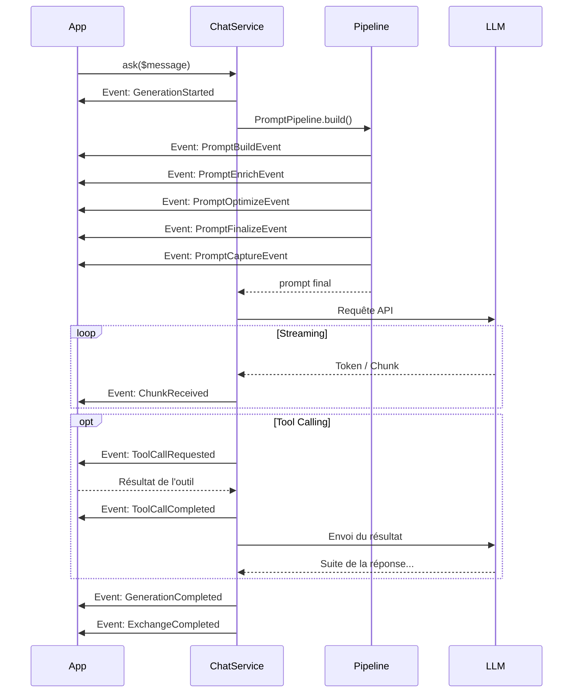

# Cycle de vie des Événements

Synapse Core est entièrement évènementiel. Cela vous permet d'intervenir à chaque étape de la génération pour modifier le comportement de l'IA.

## Séquence d'exécution

Voici l'ordre d'apparition des événements lors d'un appel à `ChatService::ask()` :

1.  **`SynapseGenerationStartedEvent`** : Début global. Initialisation.
2.  **Pipeline de prompt (5 phases)** :
    - `PromptBuildEvent` — Construction du prompt de base
    - `PromptEnrichEvent` — Enrichissement (RAG, mémoire)
    - `PromptOptimizeEvent` — Troncature du contexte
    - `PromptFinalizeEvent` — Injection de la Directive Fondamentale
    - `PromptCaptureEvent` — Capture pour le debug
3.  **`SynapseChunkReceivedEvent`** : Répété pour chaque token reçu (Streaming).
4.  **`SynapseToolCallRequestedEvent`** : Si le LLM demande un outil. Déclenche l'exécution.
5.  **`SynapseToolCallCompletedEvent`** : Une fois l'outil exécuté, contient le résultat.
6.  *Retour à l'étape 3 si le LLM a besoin de traiter les résultats d'outils.*
7.  **`SynapseGenerationCompletedEvent`** : Fin de la génération textuelle.
8.  **`SynapseExchangeCompletedEvent`** : Fin technique de l'échange (Debug & Logs).

!!! note "SynapsePrePromptEvent (déprécié)"
    L'ancien `SynapsePrePromptEvent` est conservé pour compatibilité mais ne sera plus dispatché dans une prochaine version majeure. Utilisez les events du pipeline à la place. Voir [Pipeline de Prompt](pre-prompt-event.md).

## Événements hors cycle de chat

### `SynapseStatusChangedEvent`

Dispatché quand le statut de la génération change (passage de la phase `thinking` à `generating`, ou fin de génération).

Utile pour mettre à jour l'interface utilisateur avec le statut actuel (ex: afficher un spinner "Génération en cours...").

```php
use ArnaudMoncondhuy\SynapseCore\Event\SynapseStatusChangedEvent;

class StatusUiSubscriber implements EventSubscriberInterface
{
    public function onStatusChanged(SynapseStatusChangedEvent $event): void
    {
        $event->getStatus();      // 'thinking' | 'generating'
        $event->getTimestamp();   // DateTimeImmutable du changement
    }

    public static function getSubscribedEvents(): array
    {
        return [SynapseStatusChangedEvent::class => 'onStatusChanged'];
    }
}
```

### `SynapseTokenStreamedEvent`

Dispatché pour **chaque token individuel** reçu en streaming (granularité maximale). Différent de `ChunkReceivedEvent` qui est au niveau du chunk.

Utile pour des cas d'usage très granulaires (compteur de tokens temps réel, animations, etc.).

### `SynapseFallbackActivatedEvent`

Dispatché si un fallback provider est activé (ex: passage de Gemini à OpenAI en cas d'erreur).

Permet à l'application hôte de notifier l'utilisateur du changement de provider.

```php
public function onFallbackActivated(SynapseFallbackActivatedEvent $event): void
{
    $event->getPrimaryProvider();    // ex: 'gemini' (celui qui a échoué)
    $event->getFallbackProvider();   // ex: 'openai' (le remplacement)
    $event->getReason();             // Raison du basculement (rate limit, unavailable, etc.)
}
```

### `SynapseEmbeddingCompletedEvent`

Déclenché à chaque fois qu'un embedding est généré (via `EmbeddingService`). Utilisé notamment par `TokenAccountingService` pour enregistrer la consommation en tokens liée aux embeddings.

```php
use ArnaudMoncondhuy\SynapseCore\Shared\Event\SynapseEmbeddingCompletedEvent;

class MyEmbeddingSubscriber implements EventSubscriberInterface
{
    public function onEmbeddingCompleted(SynapseEmbeddingCompletedEvent $event): void
    {
        echo $event->getModel();        // ex: "text-embedding-004"
        echo $event->getProvider();     // ex: "gemini"
        echo $event->getPromptTokens(); // tokens consommés
        echo $event->getTotalTokens();  // total tokens
    }

    public static function getSubscribedEvents(): array
    {
        return [SynapseEmbeddingCompletedEvent::class => 'onEmbeddingCompleted'];
    }
}
```

### `SynapseSpendingLimitExceededEvent`

Déclenché par `SpendingLimitChecker::assertCanSpend()` juste **avant** de lever `LlmQuotaException`, lorsqu'une requête dépasserait un plafond de dépense configuré.

Permet à l'application hôte de réagir sans modifier le core : envoyer une notification, logger l'incident, ou déclencher un fallback.

```php
use ArnaudMoncondhuy\SynapseCore\Event\SynapseSpendingLimitExceededEvent;
use Symfony\Component\EventDispatcher\EventSubscriberInterface;

class SpendingAlertSubscriber implements EventSubscriberInterface
{
    public function onLimitExceeded(SynapseSpendingLimitExceededEvent $event): void
    {
        // Qui a déclenché le blocage ?
        $event->getUserId();         // ex: "user-42"
        $event->getScope();          // 'user' | 'preset' | 'agent'
        $event->getScopeId();        // identifiant de la ressource

        // Chiffres
        $event->getLimitAmount();    // ex: 10.0
        $event->getConsumption();    // ex: 9.5
        $event->getEstimatedCost(); // ex: 1.2
        $event->getProjectedConsumption(); // 10.7 (au-dessus du plafond)
        $event->getOverrunAmount();  // 0.7 (dépassement)
        $event->getCurrency();       // 'EUR'
        $event->getPeriod();         // SpendingLimitPeriod::SLIDING_DAY
    }

    public static function getSubscribedEvents(): array
    {
        return [SynapseSpendingLimitExceededEvent::class => 'onLimitExceeded'];
    }
}
```

> `LlmQuotaException` est toujours levée après le dispatch — cet event ne permet pas d'annuler le blocage.

## Diagramme des flux


